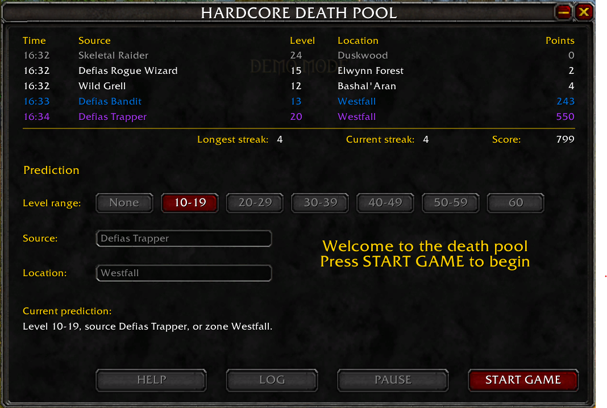

# Hardcore Death Pool

Hardcore Death Pool is a [World of Warcraft](https://worldofwarcraft.blizzard.com) mini-game addon. Players score points by predicting where and how future player deaths will happen.

 

## Overview

* Watch deaths in real time
* Try to predict the next death's location, source, or level bracket
* Earn points if your prediction matches
* Earn bonus points for streaks and combos

## Commands

- `/deathpool` to show/hide the window
- `/deathpool help` shows the help message

## Download

Download the latest release from [https://github.com/shiftclack/deathpool/releases/](https://github.com/shiftclack/deathpool/releases/)

## Install

Copy this folder into `World of Warcraft\_classic_era_\Interface\AddOns`.

## Compatibility

The addon is intended for WoW Hardcore Classic realms. It is not compatible with any other versions of the game.

## Libraries

The following libraries are included with the addon:

- [CallbackHandler](https://www.curseforge.com/wow/addons/callbackhandler)
- [LibDataBroker](https://www.curseforge.com/wow/addons/libdatabroker-1-1)
- [LibDBIcon](https://www.curseforge.com/wow/addons/libdbicon-1-0)
- [LibStub](https://www.curseforge.com/wow/addons/libstub)

## License

Copyright © 2026 Shiftclack

Except for the third-party libraries contained in the [`libs/`](libs/) directory, Hardcore Death Pool is licensed under the [PolyForm Strict License 1.0.0](LICENSE.md).
